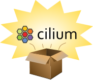

# Cilium release

This repository contains a Go utility for managing [Cilium] releases.

## Building the tool

Build the utility with:

```bash
$ make release
```

Then you can run `release help` to list available commands.

```console
$ ./release --help
release -- Prepare a Cilium release

Usage:
  release [flags]
  release [command]

Available Commands:
  changelog   Generate release notes
  checklist   Manage release checklists
  completion  Generate the autocompletion script for the specified shell
  help        Help about any command
  projects    Manage projects
  start       Start the release process

Flags:
[...]
```

## Release checklists

This repository contains checklists for the release process for different kinds
of Cilium releases (patch release, minor releases, ...). These checklists can
be accessed when creating new issues [with the GitHub interface][issue], but
the recommended way is to use the `release` tool to create an Issue
automatically (and have all references to the target release substituted to the
template placeholders).

For example:

```bash
$ ./release checklist open \
            --target-version v1.18.6 \
            --template .github/templates/release_template_patch.md
```

## Create a new release

Use the `release` utility to update GitHub projects and create release notes
for a new Cilium release:

### For a x.y.z release, a.k.a patch release

```bash
$ ./release --base <base-commit>  \
            --head <head-commit>
```

Where:
 - `<base-commit>` is `x.y.z-1`
 - `<head-commit>` should be the last commit available for the `x.y` branch.

### For a x.y.0 release, a.k.a minor release

```bash
$ ./release --base <base-commit>  \
            --head <head-commit> \
            --last-stable x.y-1
```

Where:
 - `<base-commit>` can be found with `git merge-base origin/vx.y-1 origin/vx.y`
 - `<head-commit>` should be the last commit available for the `x.y` branch.

[Cilium]: https://github.com/cilium/cilium
[issue]: https://github.com/cilium/release/issues/new/choose
